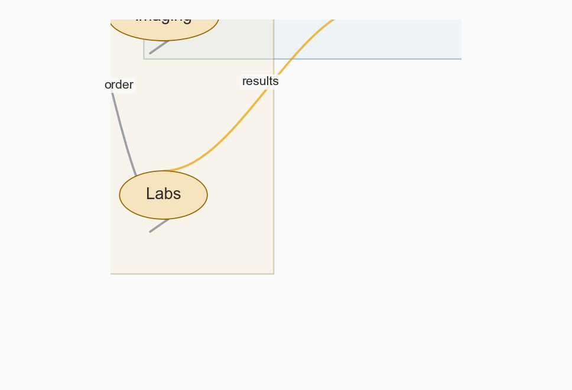
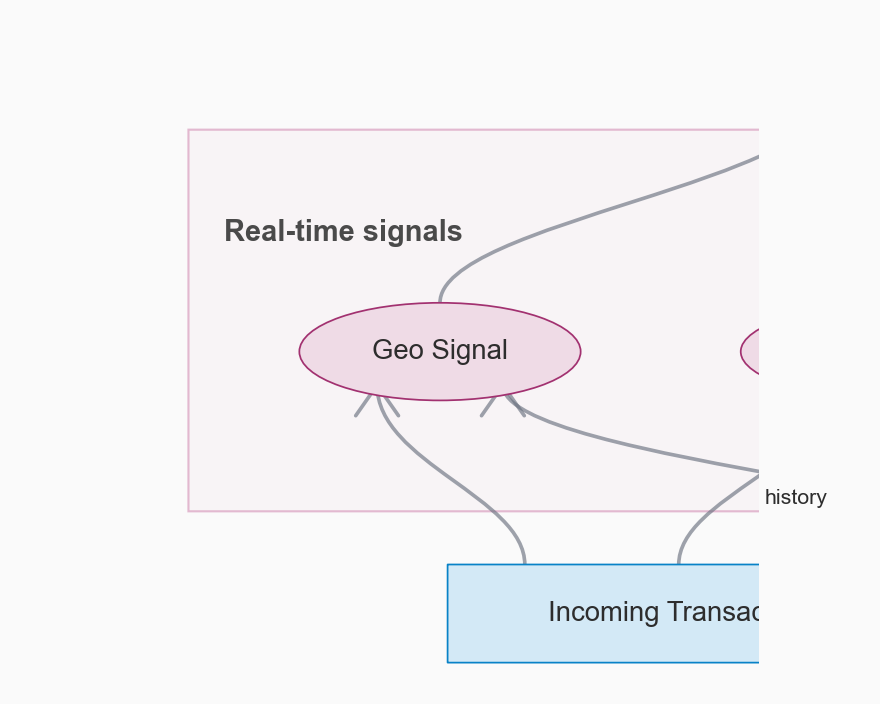
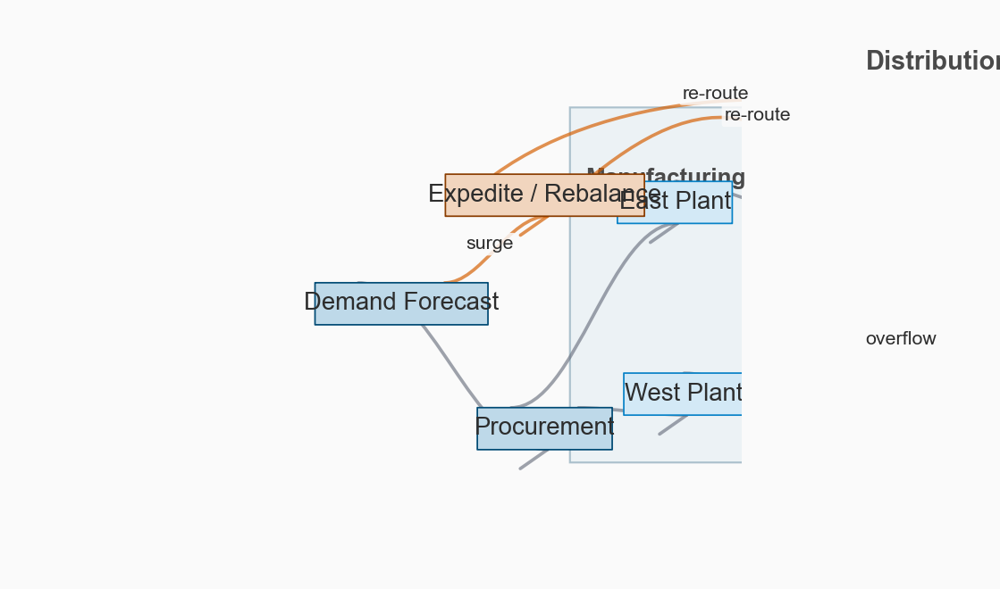
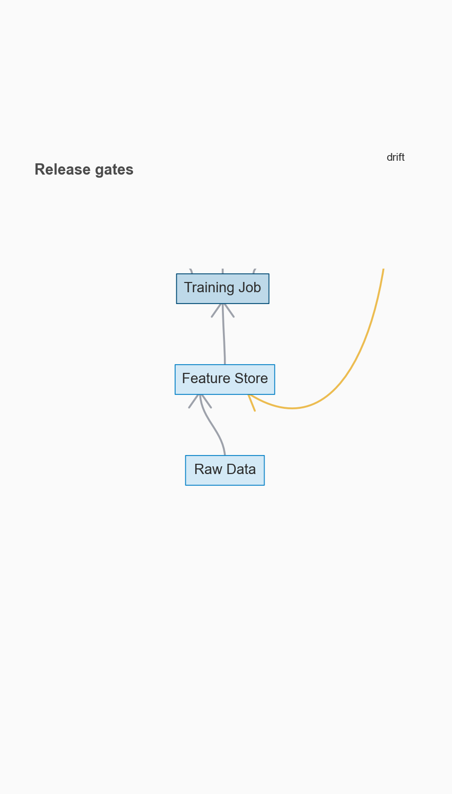
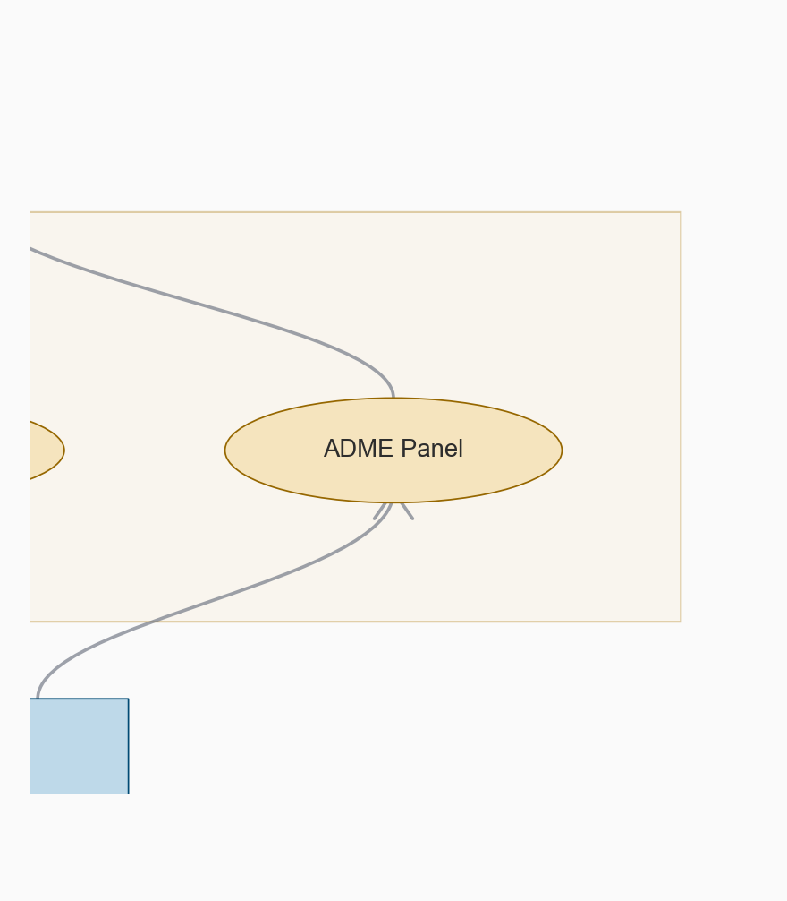
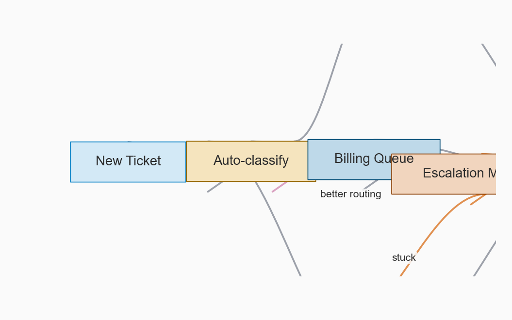
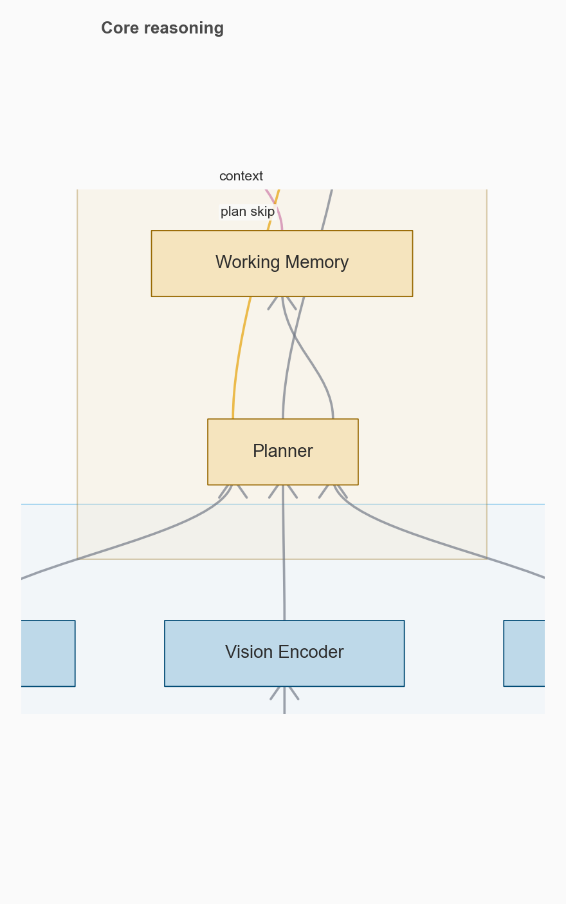
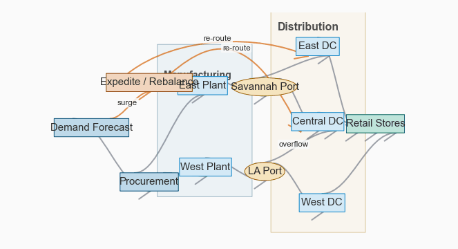

# Dagua Showcase Gallery

Autogenerated examples spanning industries, graph structures, and cinematic exports.

## Stills

### Hospital Care Pathway

- Industry: Healthcare
- Use case: Show a care team how intake, diagnostics, diagnosis, and follow-up fit together.
- Structure tags: parallel diagnostics, clusters, decision funnel
- Visual story: Parallel diagnostic branches stay legible while treatment remains the visual destination.

### Fraud Decision Engine

- Industry: Finance
- Use case: Explain real-time risk scoring and manual review paths to operations or compliance teams.
- Structure tags: fan-in, branching outcomes, signal cluster
- Visual story: A dense signal fan-in resolves into three crisp operational outcomes.

### Supply Chain Control Tower

- Industry: Operations
- Use case: Visualize how demand, plants, ports, warehouses, and reroute decisions interact.
- Structure tags: wide logistics network, clusters, long-span reroute edges
- Visual story: The wide physical network stays readable while exception paths remain obvious.

### ML Platform Release Loop

- Industry: Software / MLOps
- Use case: Show the path from data to gated release, canary deployment, monitoring, and rollback.
- Structure tags: release gates, feedback loop, nested subsystems
- Visual story: Evaluation gates read as a real release barrier rather than a tangle of side tasks.

### Robotics Autonomy Stack

- Industry: Robotics
- Use case: Communicate the handoff from sensing through planning to control, with telemetry feedback.
- Structure tags: sensor fan-in, control loop, clustered sources
- Visual story: Parallel sensing feels coherent and the feedback edge reads as a control loop, not noise.

### Drug Discovery Program

- Industry: Biotech / Pharma
- Use case: Present screening, assay filters, and preclinical gates in one clean view.
- Structure tags: funnel, parallel assays, gated progression
- Visual story: The figure reads like a program funnel, with side assays supporting a single decision spine.

### Customer Support Escalation

- Industry: Customer Operations
- Use case: Show routing, specialist queues, escalations, and knowledge capture for service teams.
- Structure tags: branching queues, feedback, operational loop
- Visual story: Escalation and learning loops are visible without overpowering the main service flow.

### Multimodal Assistant System

- Industry: AI Systems
- Use case: Explain how modalities, planning, memory, reasoning, and safety compose into a product.
- Structure tags: parallel modalities, skip path, clustered core
- Visual story: Modern model architecture motifs feel polished rather than diagrammatically clichéd.

## Animations

### Optimization Story: Multimodal Assistant

- Kind: optimization
- Caption: A faithful post-hoc optimization film showing the graph settle into a readable hierarchy.

### Tour: Supply Chain Control Tower

- Kind: tour
- Caption: A cinematic sweep from network context into the most operationally interesting logistics regions.

